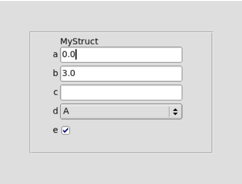

# fltk-form

This crate aims to simplify generating gui from a data structure.

## Usage
```toml
[dependencies]
fltk = { git = "https://github.com/fltk-rs/fltk-rs" }
fltk-form = { git = "https://github.com/MoAlyousef/fltk-form" }
fltk-form-derive = { git = "https://github.com/MoAlyousef/fltk-form" }
```

## Example
```rust
#[macro_use]
extern crate fltk_form_derive;

use fltk::{prelude::*, *};
use fltk_form::{FltkForm, HasProps};

#[derive(Copy, Debug, Clone, FltkForm)]
pub enum MyEnum {
    A,
    B,
    C,
}

#[derive(Debug, Clone, FltkForm)]
pub struct MyStruct {
    a: f64,
    b: f64,
    c: String,
    d: MyEnum,
    e: bool,
}

impl MyStruct {
    pub fn new() -> Self {
        Self {
            a: 0.0,
            b: 3.0,
            c: String::new(),
            d: MyEnum::A,
            e: true,
        }
    }
}

fn main() {
    let s = MyStruct::new();
    
    let a = app::App::default().with_scheme(app::Scheme::Gtk);
    app::set_background_color(222, 222, 222);
    
    let mut win = window::Window::default().with_size(400, 300);
    let mut grp = group::Group::default().with_size(300, 200).center_of_parent();
    let w = s.generate();
    grp.end();
    grp.set_frame(enums::FrameType::EngravedFrame);
    win.end();
    win.show();

    let v = w.get_prop("b");
    assert_eq!(v, Some("3.0".to_owned()));

    a.run().unwrap();
}
```


